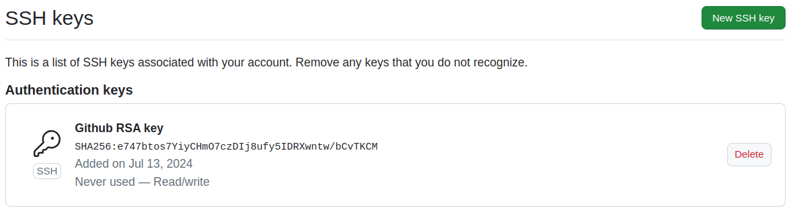

Hey everyone to my... not sure what this is going to be. Let's call it a blog for now. So how did I get here? Well, I have been working as a software developer for about 18 years now. Starting with internships in 2006, working about a day a week and part time during vacation alongside my studies 2010-2018 and then starting my first full-time job in 2019. A week ago I was invited to a job interview as a Senior React developer leading the development of large, really cool greenfield project. Long story short, I wasn't confident that I was up for the task. I was in the same situation 5 years ago. I felt crushed after an interview at a large company were they decided my Angular skills weren't enough for the position. Last week I was in the same position. I've learned so much in the last 5 years and still I am not confident enough to stand there and say "This is what i know, this is my experience. Does that fit what you are searching for?" Instead, I collapsed into myself and wasn't sure if I know single thing about web development anymore. I still feel a bit down, but i don't want the same thing to happen again in the next interview. That's why I decided to start this project. I want to take a structured approach of learning new and re-visiting old skills in web development. I want to start from a simple HTML page managed on Github and hosted on GCP and go from there. And I want to document my learnings here and see where it leads me. So welcome to the ride (No I am asking myself who I am talking to?^^)

# Setting up a Github repository
I decided to start by setting up a repository on my [Github account](https://github.com/arminh). With a little help from ChatGPT for naming the repository the [tech-journey](https://github.com/arminh/tech-journey) project is born. Next thing is to set up SSH to connect to Github and clone my repository.

## Creating an ssh key-pair:
```
ssh-keygen
Generating public/private rsa key pair.
-Enter file in which to save the key (/home/ahutzler/.ssh/id_rsa): /home/ahutzler/.ssh/id_rsa_github
Enter passphrase (empty for no passphrase):
Enter same passphrase again: 
Your identification has been saved in /home/ahutzler/.ssh/id_rsa_github
Your public key has been saved in /home/ahutzler/.ssh/id_rsa_github.pub
The key fingerprint is:
SHA256:e747btos7YiyCHmO7czDIj8ufy5IDRXwntw/bCvTKCM ahutzler@ahutzler-Precision-5530
The key's randomart image is:
+---[RSA 3072]----+
| ....            |
|  ..             |
|  ..             |
| .o o            |
|  o+ .  S        |
| o .  o  .       |
|+o.   o=...      |
|=E=+o+.o+*+      |
|oB%*=o+.o*O+     |
+----[SHA256]-----+

```

This already lead to some questions. What are the **key fingerprint** and the **key's randomart image**?

**key fingerprint**
The key fingerprint `SHA256:e747btos7YiyCHmO7czDIj8ufy5IDRXwntw/bCvTKCM ahutzler@ahutzler-Precision-5530 consists of three parts
* Hashing alorightm used: `SHA256`
* Encoded public key: `e747btos7YiyCHmO7czDIj8ufy5IDRXwntw/bCvTKCM`
* Host name: ahutzler@ahutzler-Precision-5530`

This [SSH documentation](https://docs.ssh-mitm.at/user_guide/fingerprint.html) offers a good description:
> The fingerprint ensures that you do not connect to a wrong server. One of the most common reasons for unknown fingerprints is the reinstallation of a system where new keys are generated.
> However, it can also be a Man in the Middle attack, where the connection was redirected to another server.
> For this reason, the fingerprint must always be compared against a trusted source.

**key's randomart image**

Let's add the public key of our newly created key-pair to my Github account:
1. Navigate to https://github.com/settings/keys
2. Add the publick key using the "New SSH key" dialog

It should look something like this:



Now let's use the example in the [SSH documentation](https://docs.ssh-mitm.at/user_guide/fingerprint.html) to connect to github:
```
ssh github.com
The authenticity of host 'github.com (140.82.121.4)' can't be established.
ED25519 key fingerprint is SHA256:+DiY3wvvV6TuJJhbpZisF/zLDA0zPMSvHdkr4UvCOqU.
This key is not known by any other names
Are you sure you want to continue connecting (yes/no/[fingerprint])?
```

Before confirming with yes, let's make sure the fingerprint is valid by checking the [Github's SSH key fingerprints](https://docs.github.com/en/authentication/keeping-your-account-and-data-secure/githubs-ssh-key-fingerprints) or executing
```
ssh-keyscan github.com  >github.ssh-keyscan
cat github.ssh-keyscan
```

And indeed the ED25519 fingerprints match. So it is safe to connect. Let's try again:
```
ssh github.com
The authenticity of host 'github.com (140.82.121.3)' can't be established.
ED25519 key fingerprint is SHA256:+DiY3wvvV6TuJJhbpZisF/zLDA0zPMSvHdkr4UvCOqU.
This key is not known by any other names
Are you sure you want to continue connecting (yes/no/[fingerprint])? yes
Warning: Permanently added 'github.com' (ED25519) to the list of known hosts.
@@@@@@@@@@@@@@@@@@@@@@@@@@@@@@@@@@@@@@@@@@@@@@@@@@@@@@@@@@@
@         WARNING: UNPROTECTED PRIVATE KEY FILE!          @
@@@@@@@@@@@@@@@@@@@@@@@@@@@@@@@@@@@@@@@@@@@@@@@@@@@@@@@@@@@
Permissions 0644 for '/home/ahutzler/.ssh/rlt-deployment' are too open.
It is required that your private key files are NOT accessible by others.
This private key will be ignored.
Load key "/home/ahutzler/.ssh/rlt-deployment": bad permissions
```

Okay this is harder than expected. I don't remember using this SSH key, so let's delete it and try again:
```
ssh github.com
no such identity: /home/ahutzler/.ssh/rlt-deployment: No such file or directory
ahutzler@github.com: Permission denied (publickey).
```

Okay it still trys to use the deleted key. Let's check the ssg config. And yep, there it is:

```
Host *
    AddKeysToAgent yes
    IdentityFile ~/.ssh/id_rsa
    IdentityFile ~/.ssh/rlt-deployment
```

Let's remove the rlt-deployment entry and add `id_rsa_github` to the list. And... try again:
```
ssh github.com
ahutzler@github.com: Permission denied (publickey).
```

Oh man... still not quite there yet. Github docs to the rescue: [Always use the "git" user](https://docs.github.com/en/authentication/troubleshooting-ssh/error-permission-denied-publickey#always-use-the-git-user)

```
ssh git@github.com
PTY allocation request failed on channel 0
Hi arminh! You've successfully authenticated, but GitHub does not provide shell access.
Connection to github.com closed.
```

Success!!! Oh man, that took way longer than expected. Let's try to clone the project repository using ssh:

```
git clone git@github.com:arminh/tech-journey.git
Cloning into 'tech-journey'...
remote: Enumerating objects: 4, done.
remote: Counting objects: 100% (4/4), done.
remote: Compressing objects: 100% (4/4), done.
remote: Total 4 (delta 0), reused 0 (delta 0), pack-reused 0
Receiving objects: 100% (4/4), done.
```

Nice! That did it. Let's add this markdown file to the repository and create a commit. Why not use the shell:
``
